# Setup

## Prerequisites

* Ensure correct version (32-bit or 64-bit) of JDK (7 or 8) is installed on the system based on its bitness 
* Ensure atleast 4 GB of RAM and 10 GB of HDD space is available in addition to the needs of the operating system
* Ensure that `java` is found on that system path. One should be able to run the command `java` at the command prompt from anywhere

## Binaries 

Follow the instructions in the README under the folders *binaries* and *jdbc-drivers* to download the required binaries for the setup

In a workshop setting, these binaries will be provided to you on a USB stick in similarly marked folders. 

## Installation 

In the root folder of the lab run one of the following commands:

* On Windows run : `install.bat`
* On Unix/Linux/Mac run: `./install.sh` 

The silent installation creates the folders `deployments/jbdevstudio/` for JBoss Developer Studio and `deployments/dv` for JBoss Data Virtualization from the root folder of the workshop. 

## Configuring JBoss Developer Studio

### Increase the default memory allocated for JBoss Developer Studio

This is a very important step and **not** to be skipped especially when the intention is to use plugins in JBDS (example: Data Virtualization) that do some UI heavy lifting. While the application is shut, locate the **jbdevstudio.ini** file in the installation. The path to this file can differ between platforms, on Unix/Linux/MacOSX systems run the following command in the installation folder to track its exact location:

```sh
find . -name "jbdevstudio.ini"
```

Open the file and find entries like the ones shown below **OR** add them to the file, if they are missing, under `-vmargs`. Depending on the capacity of the development VM, allocate a high number to the memory, example : 2048m, ideally to both -Xms and -Xmx.

```sh
-Xms512m
-Xmx1024m
```

### Follow the steps below to complete the configuration

**Step 1 :** Launch the JBoss Developer Studio from the folder `deployments/jbdevstudio` or run one of the following command from the root folder of the workshop:
  * On *Windows* : Run `deployments\jbdevstudio\jbdevstudio.bat`
  * On *Linux\Unix* : Run `deployments/jbdevstudio/jbdevstudio`
  * For *Mac OS X* : Run `open deployments/jbdevstudio/jbdevstudio.app` 

Provide the path to the location of workspace. For the workshop, choose the path to the *workspace* folder in workshop's root folder. 
[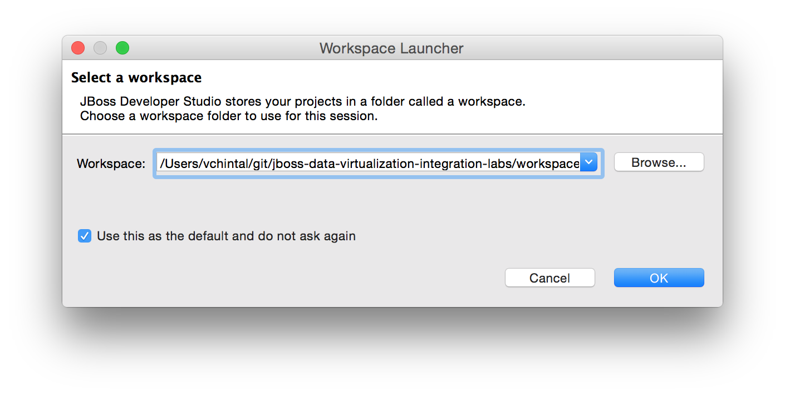](.images/ds-first-start.png)

**Step 2 :** Click on the Workbench icon on top-right corner of the screen
[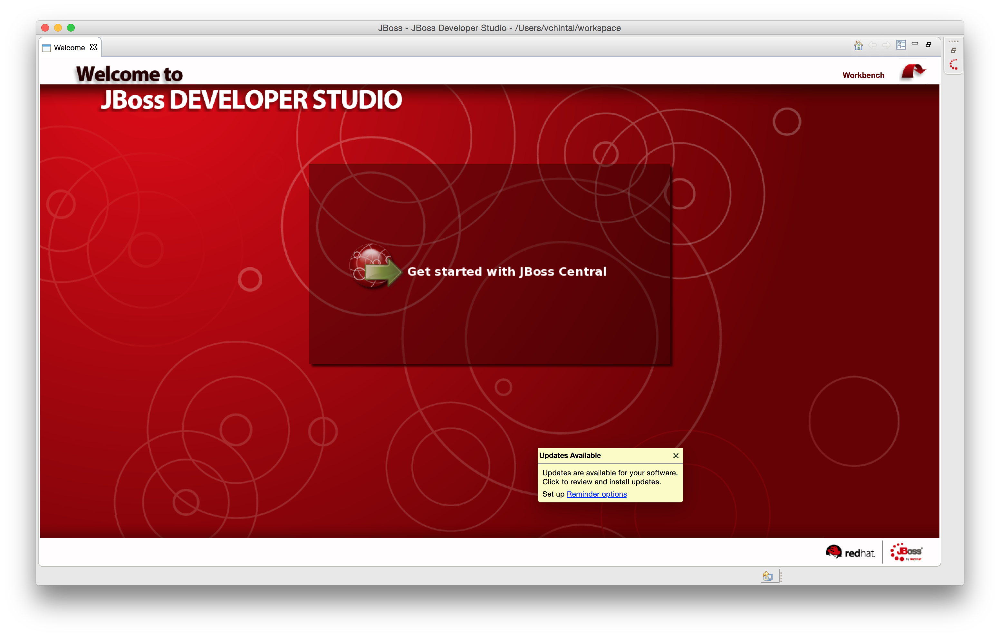](.images/ds-first-spalsh.png)

#### Software Update Alternative 1

**Step 3.1 :** Click on the 2nd tab: **Software/Update** found at the bottom of the **JBoss Central** frame
[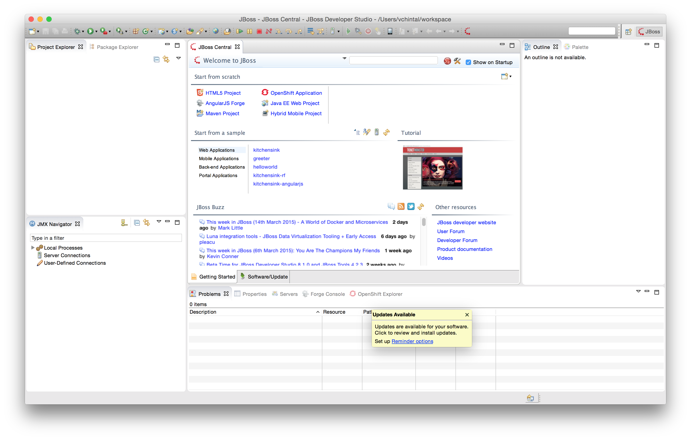](.images/ds-first-look-workspace.png)

**Step 3.2 :** Choose one or more updates, for example: **JBoss Data Virtualization Development** to be applied to current installation and click on **Install/Update**
[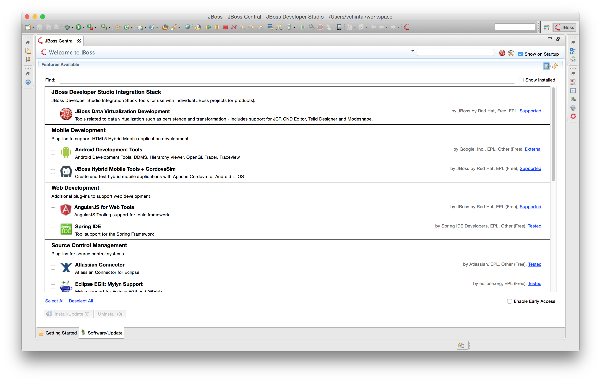](.images/ds-update.png)

#### Software Update Alternative 2

**Step 3.1 :** Click on **Install New Software** on the **Help** menu item 

[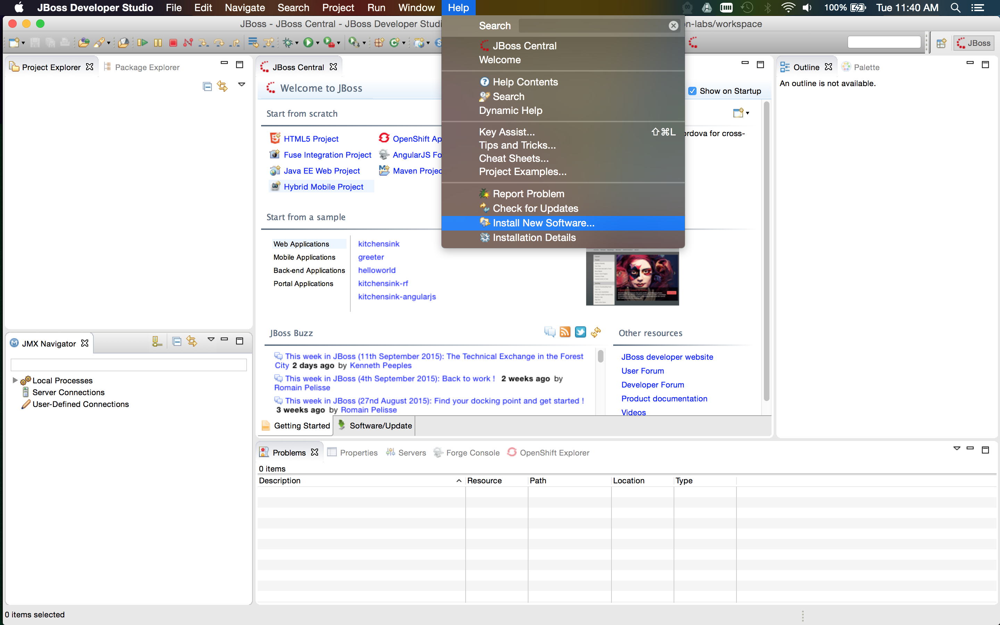](.images/ds-jdv-install-software.png)

**Step 3.2 :** Click on the *Add* button and fill in the details as shown in the image. For the archive, browse the location of the file provided and placed in `binaries/jbdevstudio-integration-stack-updatesite-8.0.3.GA.zip` and click on **OK**.
[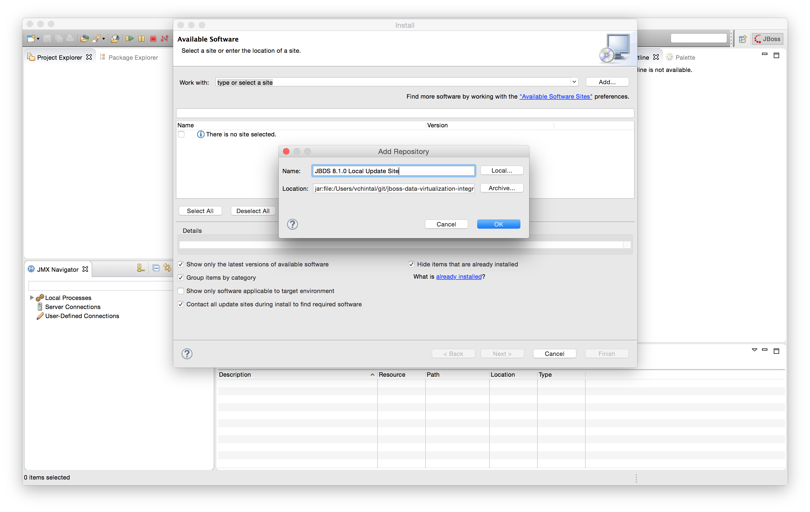](.images/ds-jdv-local-archive.png)

**Step 3.3 :** From the available software list pick **JBoss Data Virtualization Development** and click on **Next**
[](.images/ds-jdv-install-dv-from-local-update.png)

**Step 4 :** The rest of the update process should mirror the images shown below and in the sequence shown. To move ahead at each step click OK/Next/Finish as provided. The update should end with a prompt to restart the JBDS.
[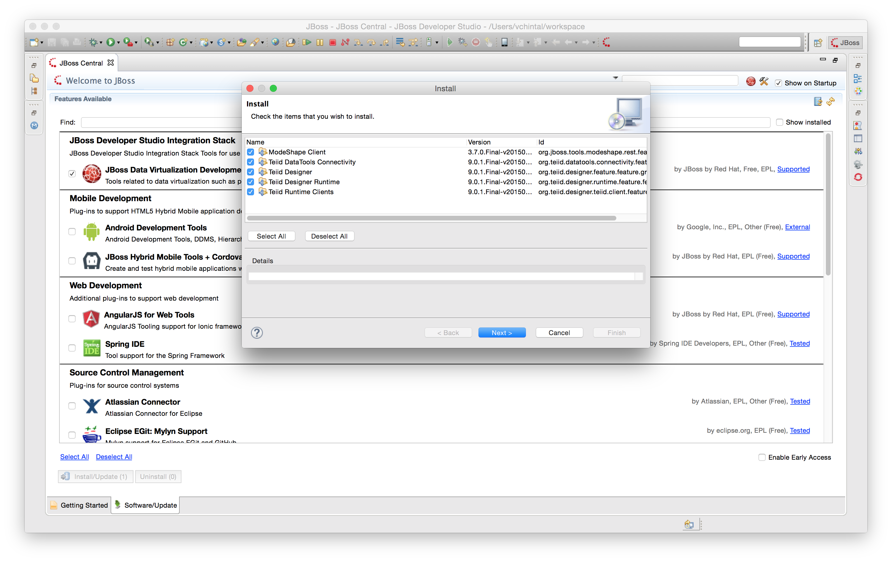](.images/ds-jdv-update-install.png)
[](.images/ds-jdv-update-license.png)
[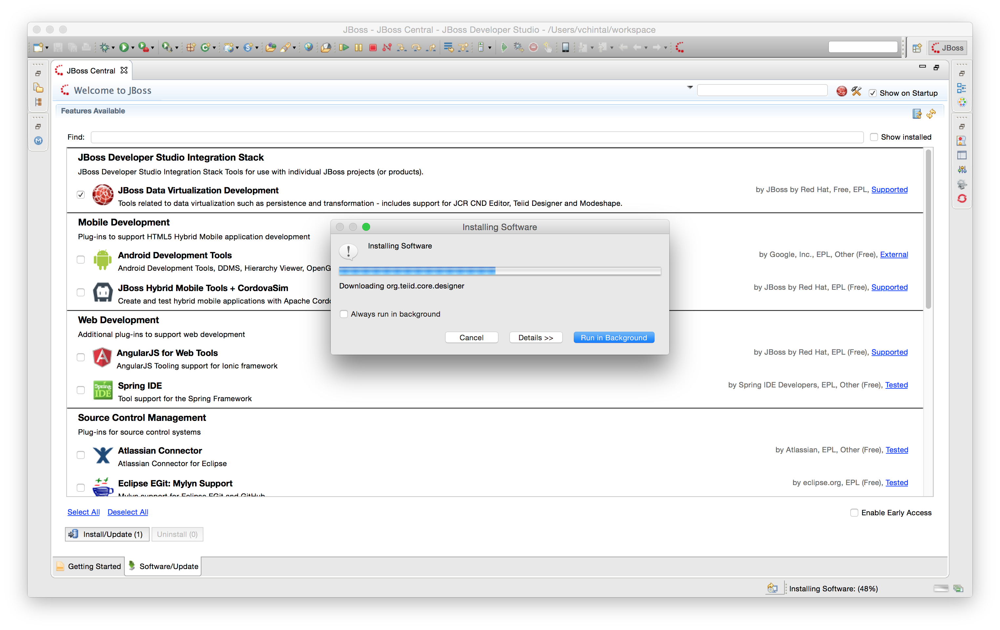](.images/ds-jdv-update-progress.png)
[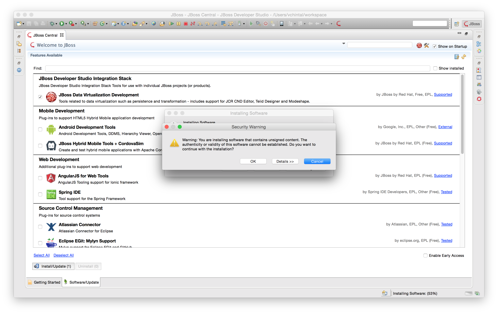](.images/ds-jdv-update-confirmation.png)
[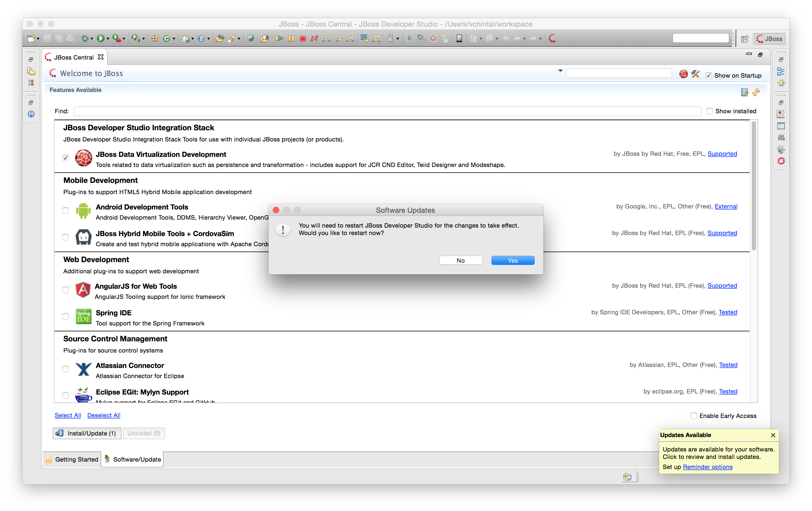](.images/ds-jdv-update-restart.png)


## Configuring JBDS for JBoss Data Virtualization 

This section would guide the last steps of configuring the JBoss Developer Studio for Data Virtualization. 

### Create a new server in JBDS

Launch JBDS. In the JBDS menu choose **Window → Show View → Servers**. If a link is shown that says **No servers available ...**, click on it. A new dialog should be presented that resembles the image shown below. Create a new server by the name **JBoss Data Virtualization** and click **Next** to continue.
[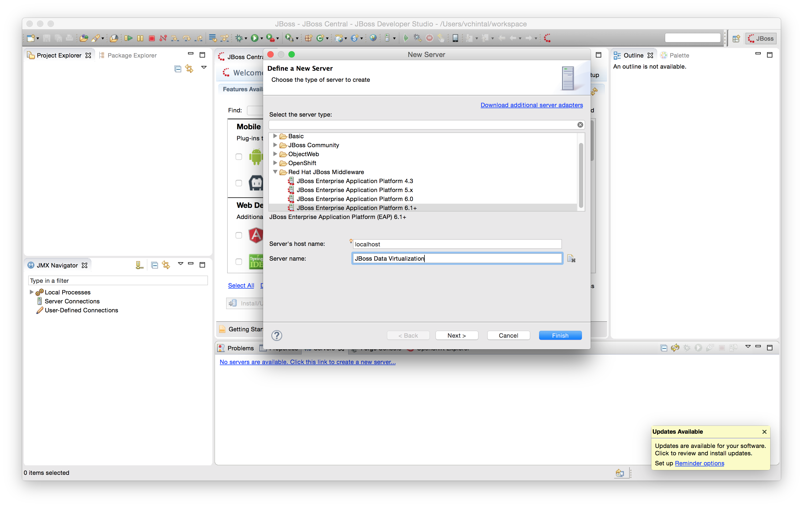](.images/ds-jdv-new-server.png)

### Create a new Server Adapter

When creating a new Server Adapter 

* Choose local if the runtime server is on the same VM as JBDS. JBDS should ideally connect and work with local runtime server for development purposes and for this exercise that would be the choice
* Choose remote if the runtime server is running on a different VM but on a reachable network
* Ideally choose **Management Operations** in **Controlled by** options

If no runtime was ever created the dropdown shown below would default to 'Create new runtime'. Click **Next** to go to that screen
[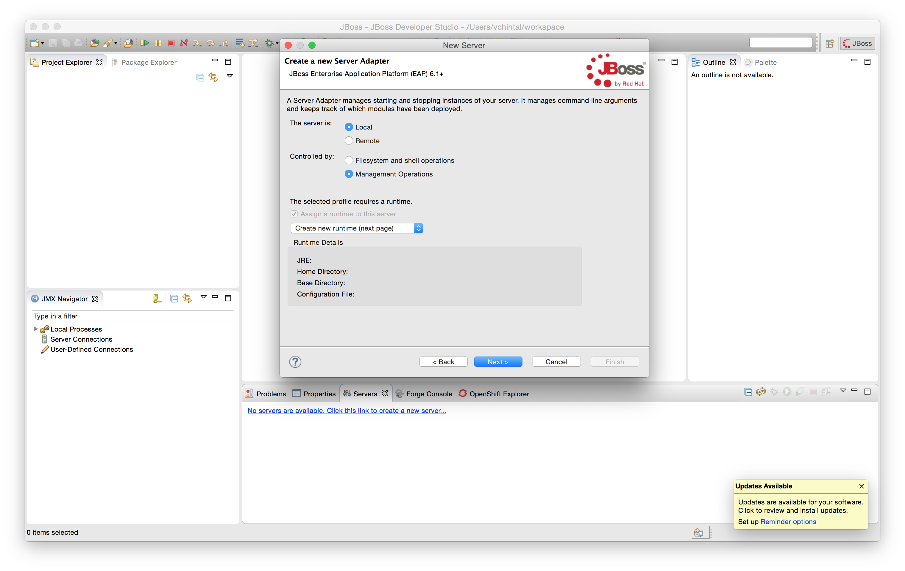](.images/ds-jdv-server-adapter.png)

### Create a new Server Runtime

As shown below, provide the path to the JBoss Data Virtualization (`deployments/dv` from workshop's root folder) and choose the correct **Execution Environment** while leaving the rest intact. Click on **Finish** to complete the setup of a new server.
[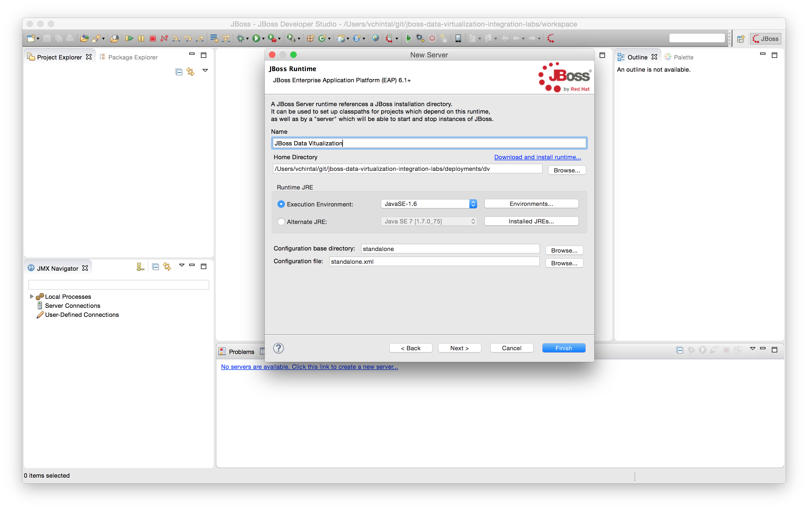](.images/ds-jdv-server-runtime.png)

### Configure the newly created server

Once the server is created, click on the name of the server in the list at the bottom to launch a window displaying the configuration. Since the **local** profile is chosen, the only option that makes any difference in how JBDS interacts with the runtime server is whether the **Server is externally managed** checkbox under **Server Behavior** as shown in the image.

* If the box is checked, the server has to be started independently of JBDS. This approach doesn't necessarily control server's start/stop behavior.
* If the box is cleared, then the server can be started/stopped thru JBDS  If the JBDS process exits, the server runtime is killed as well. The image below reflects this option.

[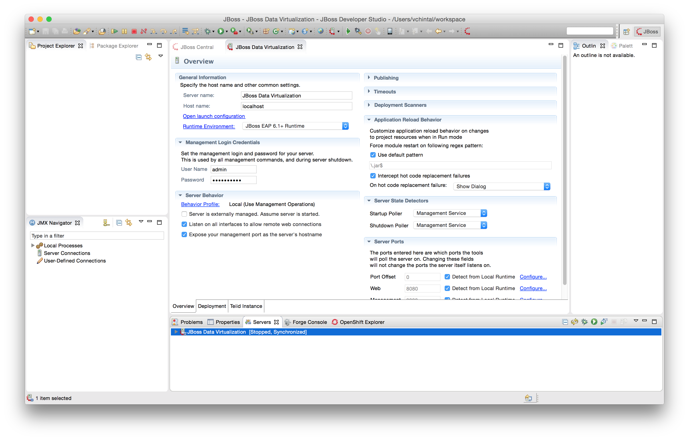](.images/ds-jdv-server-configuration.png)

### Working in Teiid perspective

To get started on new Model projects, choose the Teiid perspective by going to the JBDS menu and selecting **Window → Open Perspective → Other → Teiid Designer** as shown below
[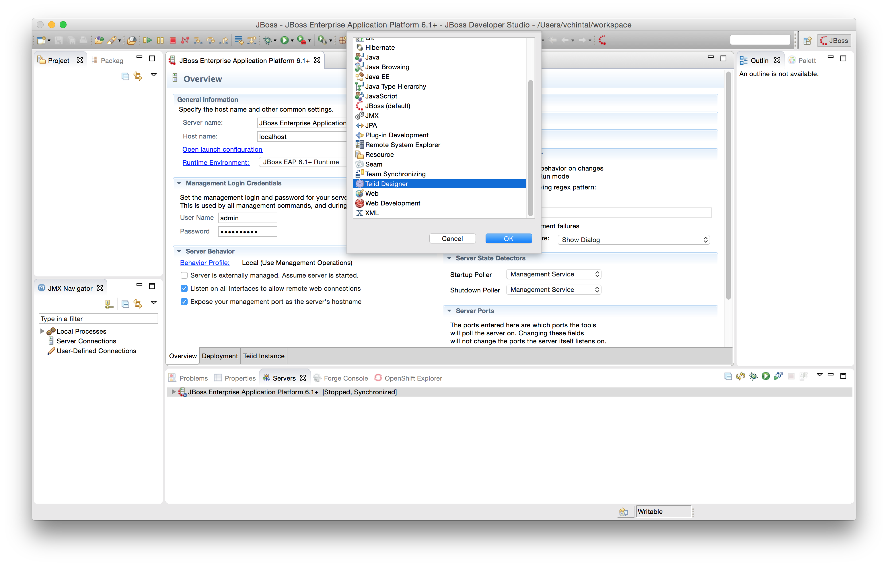](.images/ds-jdv-perspective.png)

### Getting started with projects

The last step before getting started with projects is to connect JDBS to the runtime server. This could be done by right clicking on the server name in the server list and then choosing 'Start'. When started in this manner, in the **Teiid perspective**, on the left hand side under **Default Server** one can notice a blue glow next to label **Teiid Version** as shown below. This indicates a successful connection to the runtime server and the development can now begin.
[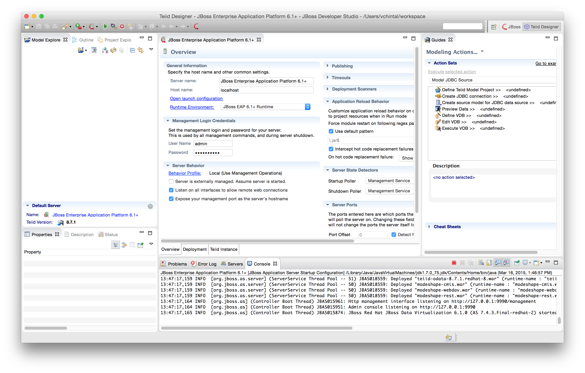](.images/ds-jdv-local-start.png)
