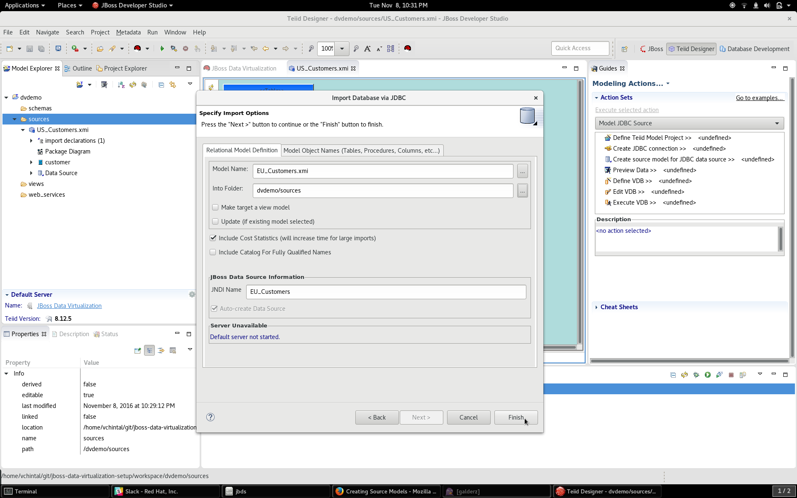

# Creating Source Models

## Lab Scenario

A retail brokerage firm has users in different parts or the world. The data relating to United States customers is held in a MySQL database whereas the data for European customers is held in PostgresSQL database. The firm is now interested in a real-time aggregate of both customer entries on some limited number of fields.

## Lab Workflow

### Create a Teiid Model Project

1. In JBoss Developer Studio, switch to **Teiid Designer** perspective (refer to end of setup lab for more details)
2. Create a new project by clicking on **File → New → Teiid Model Project**
3. Give the project the name **dvdemo** and click **Next** till the last screen and then click on **Finish** button

Your project in the workspace should look like the image below: 

### Create US Customers Source Model

Right click on the **sources** folder and choose **Import**. In the window that pops up, choose **Teiid Designer → JDBC Database >> Source Model** 

You will now be presented with a window to choose a JDBC configuration. Since no connection profiles were ever created, click on **New** button to create a new **Lab MySQL** connection profile. Choose **MySQL** in the available connection profiles and give it a name **Lab MySQL**. When done, click **Next**

You will now be presented with a window to choose a JDBC driver. Click on the circular button adjacent to the dropdown to select a new JDBC driver. Choose the driver version as shown in the image and then move on to the next tab **JAR List** in the same window.

In the **JAR List** tab, remove existing JAR drivers and add a new driver by choosing the MySQL jar file in the `jdbc-drivers` folder of the lab material. Once done, click on **Ok**

Now fill in the connection properties to the MySQL instance. With rest all remaining the same, use the **hostname** and **port number** as provided by the instructor. The username/password for all the connections is **dvuser/dvuser**. Click on **Test Connection** to verify connectivity. Click on **Finish** when done.

In the next window, **Select Database Metadata**, choose only **TABLE** and click **Next**

Choose only **customer** table for the database object whose metadata needs to be imported

In the final window, fill in the fields as shown below before clicking on **Finish**

b2-mysql-table-import-options.png

When all is done, your project should look like the image shown below

Finally test the source table by right-clicking on the table and choosing **Modeling → Preview Data**. For this to work ensure that the **Teiid Instance** tab of your server instance has right username and password filled out with **teiidUser** and **admin123!** respectively.

### Create EU Customers Source Model

Now that you are familiar with importing a JDBC Database to a source model, you can repeat the same for importing EU customers from PostgresSQL server. Follow the images for reference

