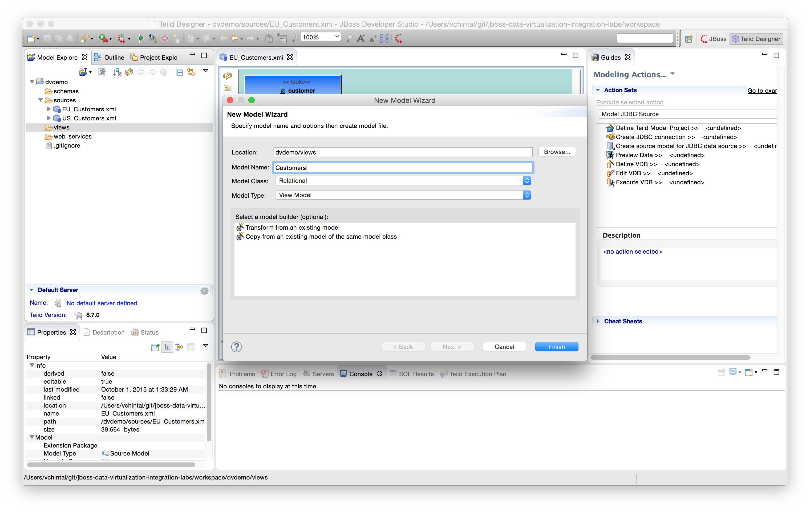
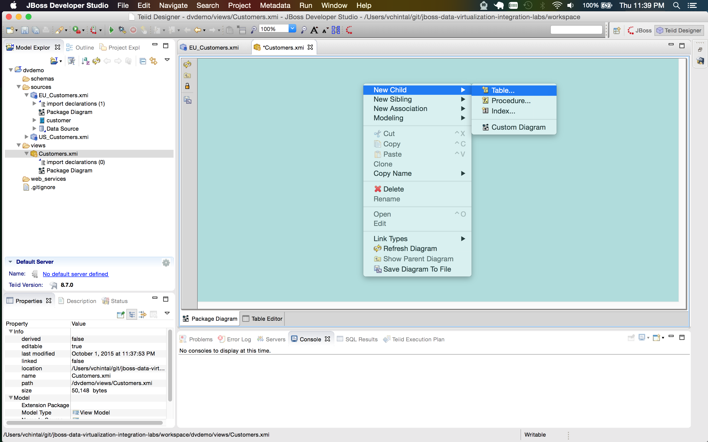
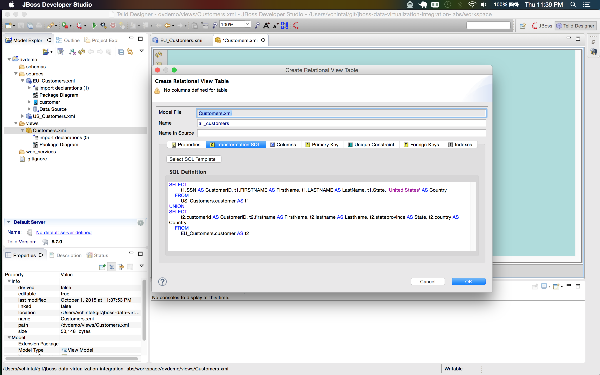
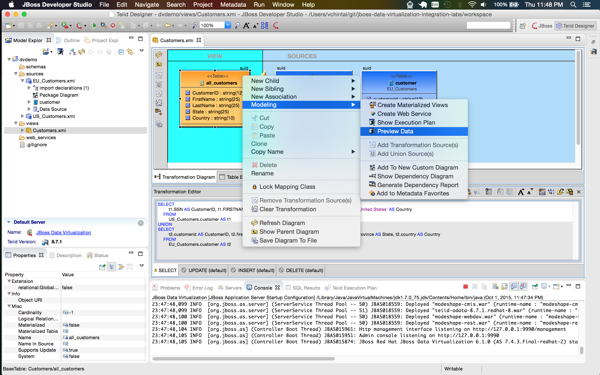
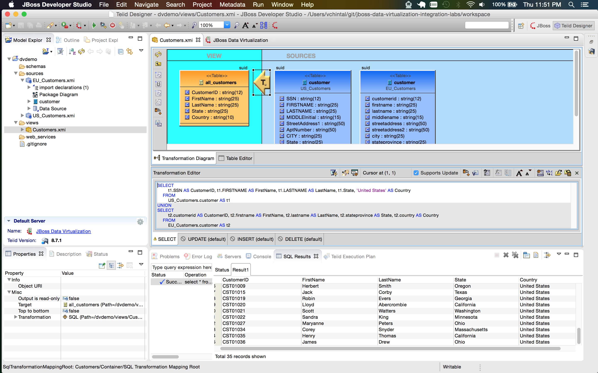

# Creating View Models

In the last lab we created source models which contained the metadata of each physical table that was imported. In this lab we will create a _view_ model and create one or more _virtual_ objects that we want to expose to the client applications. 

## Create View Model 

Right click on the `views` folder and choose **Teiid Metadata Model**. In the **New Model Wizard** put **Customers** as the name of the model, for model type choose **View Model** and click on Finish. A file by the name **Customers.xmi** is created and when you open the file in the designer a blank teal canvas opens up.

[](.images/lab3-1-create-view-model.png) 

## Create Virtual Relational Objects

Right click on the canavas of the **Customers.xmi** and choose **New Child → Table**. Give the table the name **all_customers**.

[](.images/lab3-2-create-virtual-table.png)

In the **Transformation SQL** tab of the **Create Relational View Table** window. Populate the following SQL as shown below and click on **Ok**. This will create a yellow rectangle with metadata of the table we would like to expose to client apps.

```sql 
SELECT
		t1.SSN AS CustomerID, t1.FIRSTNAME AS FirstName, t1.LASTNAME AS LastName, t1.State, 'United States' AS Country
	FROM
		US_Customers.customer AS t1
UNION
SELECT
		t2.customerid AS CustomerID, t2.firstname AS FirstName, t2.lastname AS LastName, t2.stateprovince AS State, t2.country AS Country
	FROM
		EU_Customers.customer AS t2
```

[](.images/lab3-3-transformation-sql.png)

## Preview the Virtual View Table

Right click on the **all_customers** table and choose **Modeling → Preview Data** as show below.

[](.images/lab3-4-preview-data.png)

Note the count of number of records that were returned. You should a total of **35** records, **17** from US Customers and **18** from EU Customers. IF you see the same outcome as below, you have successfully completed the lab.

[](.images/lab3-5-preview-results.png) 
