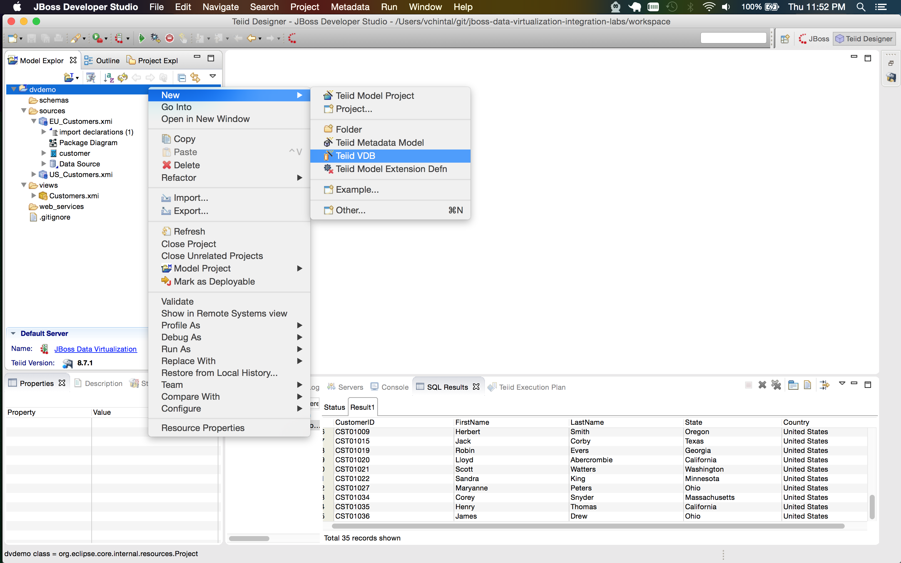
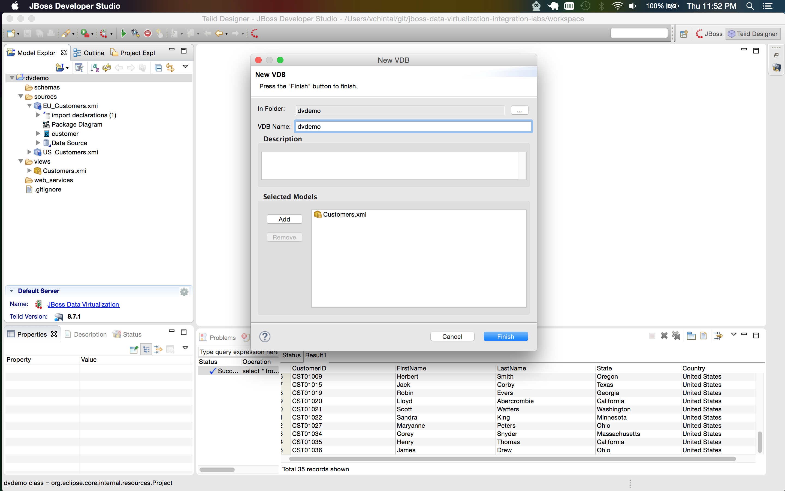
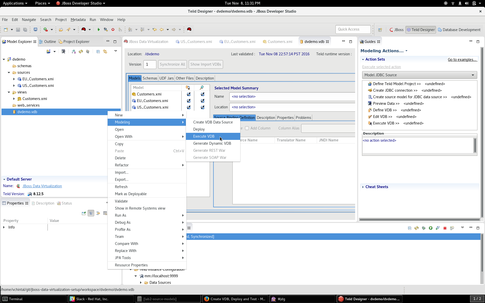
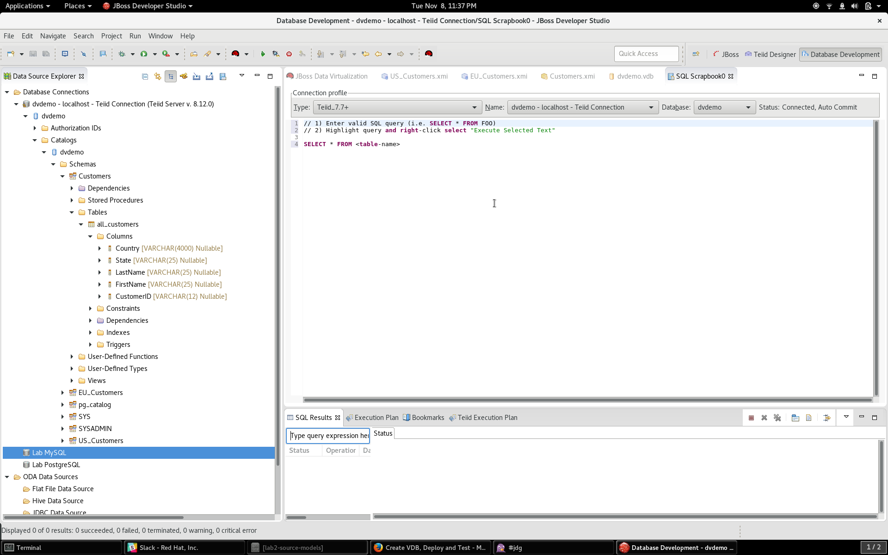
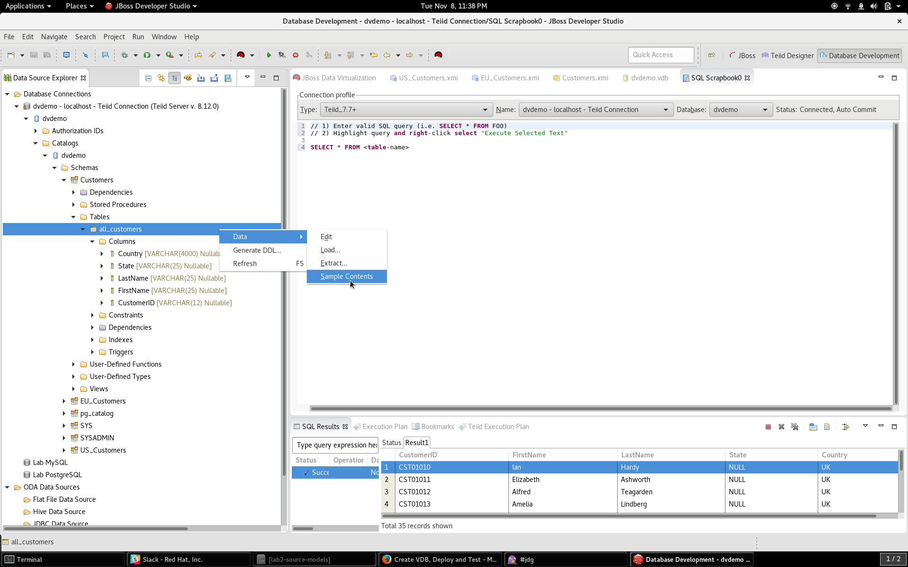

# Create VDB, Deploy and Test

Now that both source models and view models have been created, it is time to package the view models and the source models it depends into a **Virtual Database** with an **.VDB** extension, deploy it on the DV runtime server and connect to it thru any JDBC client. For this exercise we will use the **Database Development** perspective of the Developer Studio as the JDBC client to the deployed virtual database.

## Create a VDB 

Right click on the project and choose **New → Teiid VDB**.

Give it the same name as the project and call it **dvdemo**. Click on the **Add** button, add the view Model **Customers** and click **Finish**.

Now, save the **dvdemo.vdb**.

## Execute the VDB

Right click on the created VDB and choose **Modeling → Execute** as shown below while the JBoss Developer Studio is connected to the DV runtime.

## Test the deployment

Browse thru the DB hierarchy and verify the **Customers.all_customers** metadata as shown below

Verify the virtual view is working by right clicking on the **all_customers** and choosing **Data → Sample Contents** as shown below.

Verify the row count to match the pre-deployment rowcount of **35** as shown below. If you see the same output as shown below, you have completed the lab successfully.

Congrats!!

