# Create VDB, Deploy and Test

Now that both source models and view models have been created, it is time to package the view models and the source models it depends into a **Virtual Database** with an **.VDB** extension, deploy it on the DV runtime server and connect to it thru any JDBC client. For this exercise we will use the **Database Development** perspective of the Developer Studio as the JDBC client to the deployed virtual database.

## Create a VDB 

Right click on the project and choose **New → Teiid VDB**.

[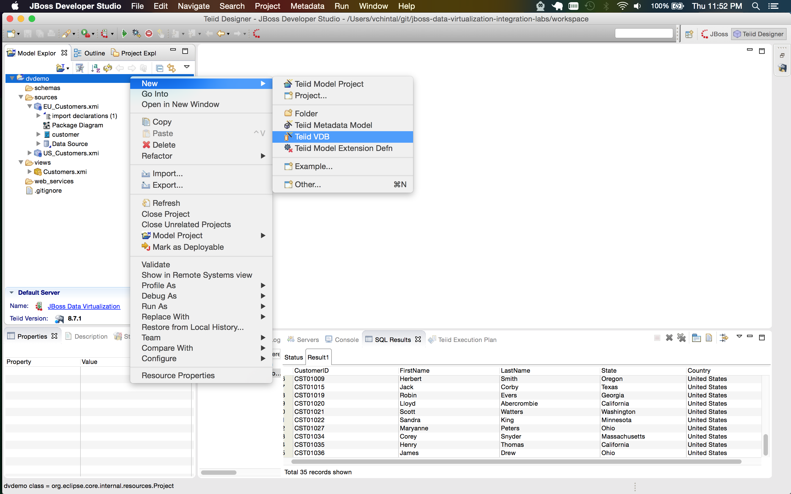](.images/lab4-1-create-new-vdb.png)

Give it the same name as the project and call it **dvdemo**. Click on the **Add** button, add the view Model **Customers** and click **Finish**.

[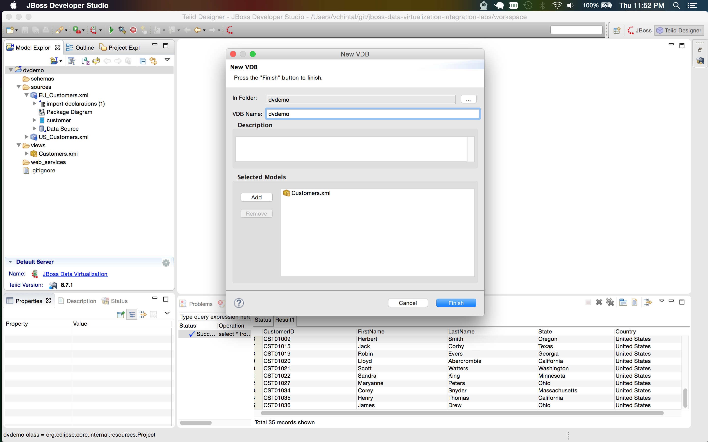](.images/lab4-2-add-models.png)

## Create new Datasource on the DV runtime

Navigate to the **Servers** outline view, browse to the **Teiid Instance Configuration** of the DV Runtime Server. Right click on the **Data Sources** node and choose **Create Data Source**. 

[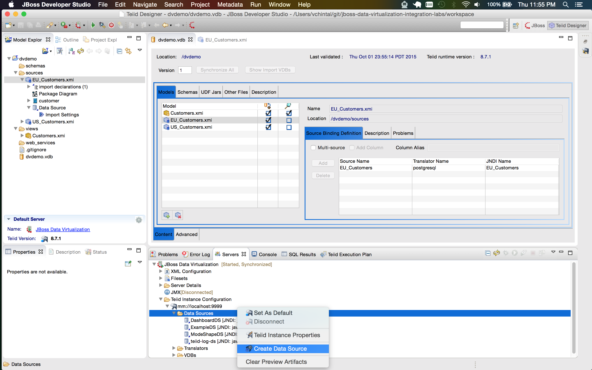](.images/lab4-3-create-new-ds.png)

Choose **Lab MySQL** profile with a data source name **US_Customers** and click on **Ok**.

[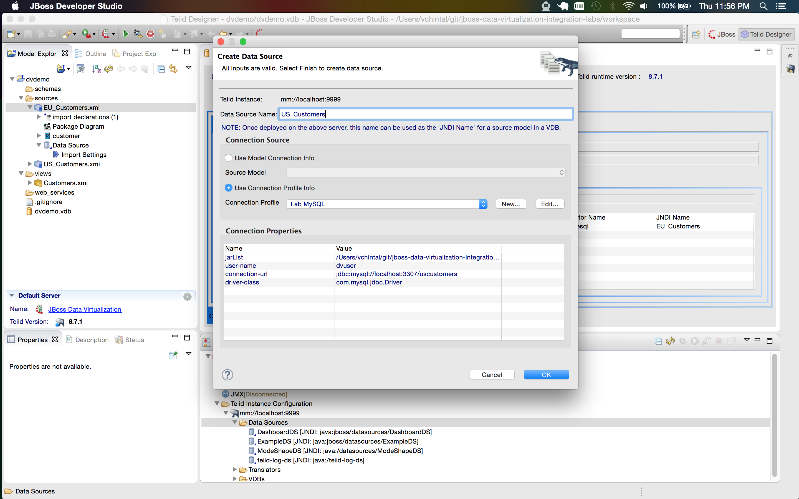](.images/lab4-4-add-mysql-ds.png) 

Repeat the same steps to create a data source **EU_Customers** with **Lab PostgreSQL** profile.

[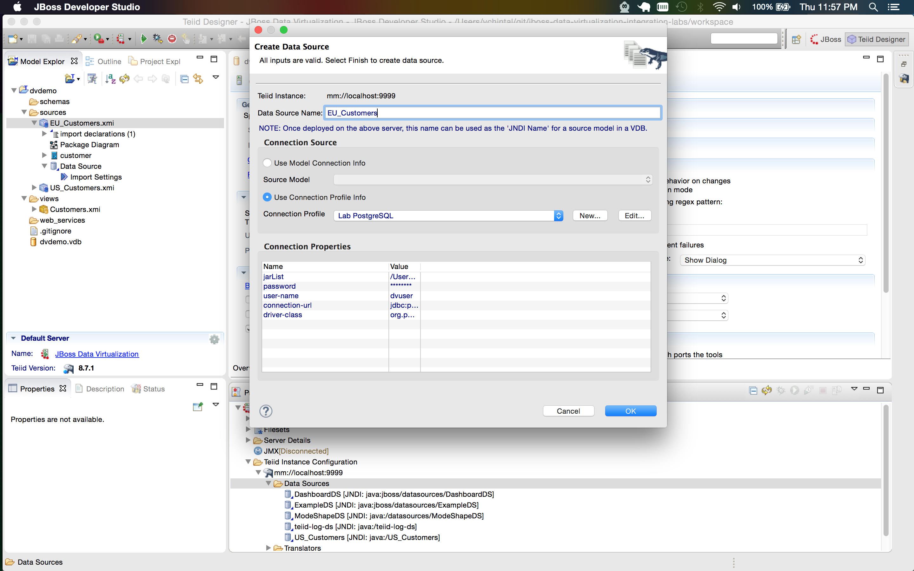](.images/lab4-5-add-postgres-ds.png)

## Bind the Source Models to datasources on runtime by name (JNDI)

The way to make the VDB portable is to bind the source models to the data sources deployed on the DV runtime by name. This lets VDB to be moved between different environments as long as the datasources by the same name map to different hostname and ports. 

Click on EU\_Customers.xmi in the list of models and then in the **Source Binding Definition**, click on the **JNDI Name** box for **EU_Customers** and then choose **java:/EU_Customers**. 

Repeat the same for source model US\_Customers.xmi.

[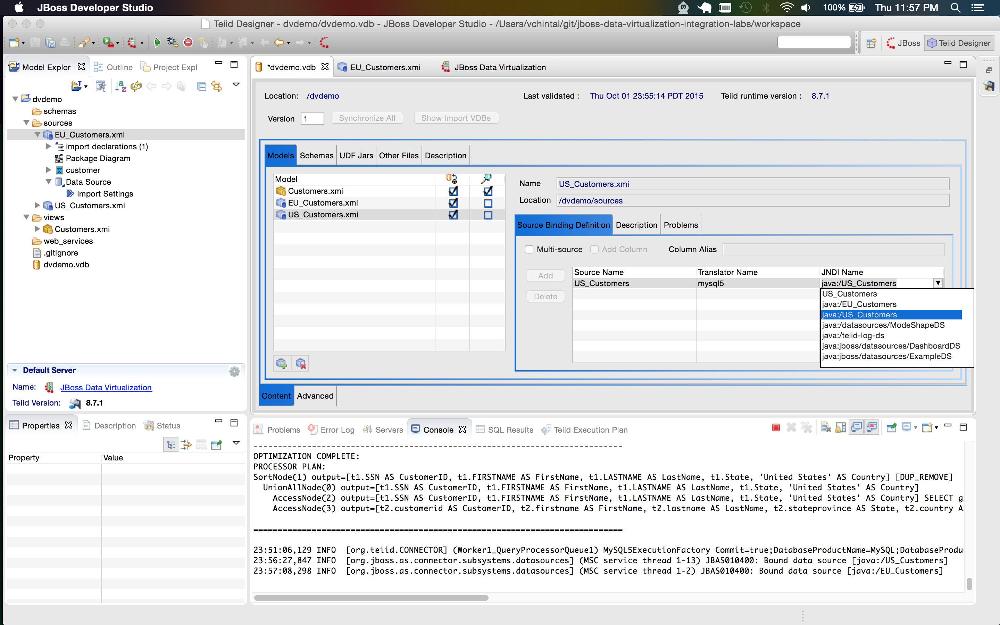](.images/lab4-7-bind-to-mysql-jndi.png)

Now, save the **dvdemo.vdb**.

## Deploy the VDB

Right click on the created VDB and choose **Deploy** as shown below while the JBoss Developer Studio is connected to the DV runtime.

[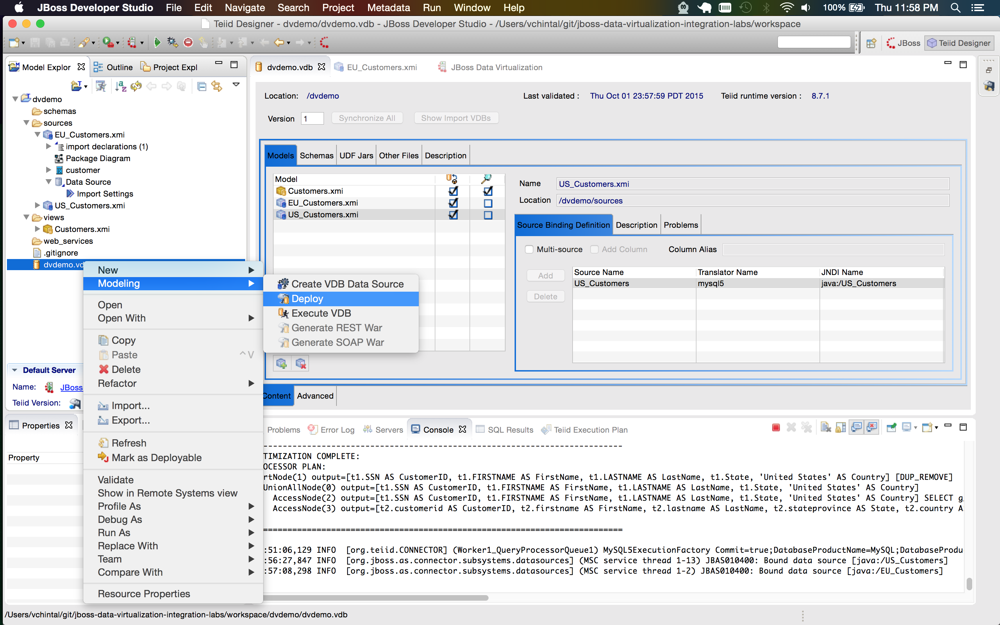](.images/lab4-8-deploy.png)

Choose the same deployment name for the data source in case you would like to run a web application on the DV runtime (though not recommended) that needs to refer to the datasource by its JNDI name.

[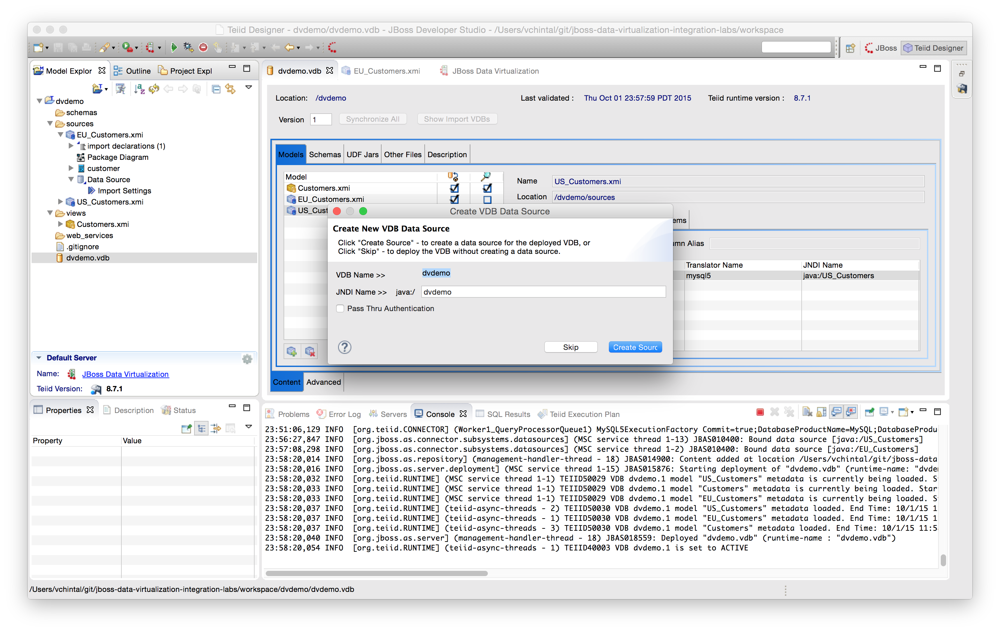](.images/lab4-9-deploy-ds.png)

## Test the deployment

Verify that deployment was successful as shown in the **console** output in the image below. If the deployment was successful, change to the **Database Development** perspective by choosing **Window → Open Perspective → Database Development** as shown below.

[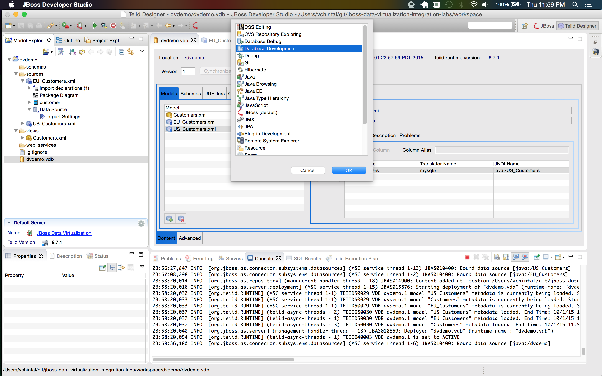](.images/lab4-10-dd-perspective.png)

Create a new database connection by right clicking on the **Database Connections** and choosing **New**.

[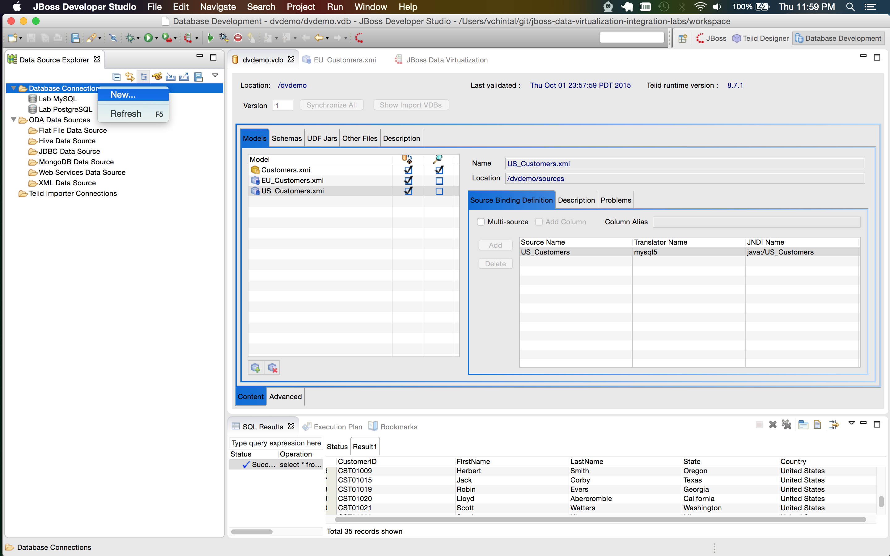](.images/lab4-11-new-conn-profile.png)

Choose **Teiid** in the available connection profile, give it a name **Lab Teiid** and click on **Next**.

[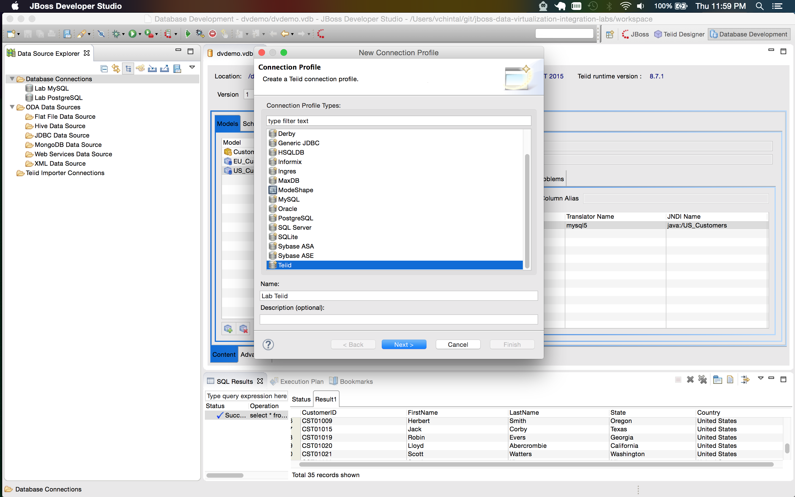](.images/lab4-12-teiid-conn-profile.png)

Fill in the connection properties as shown in the image below. The username/password for this connection would be **teiidUser/admin123!** with rest of the details being the same.

[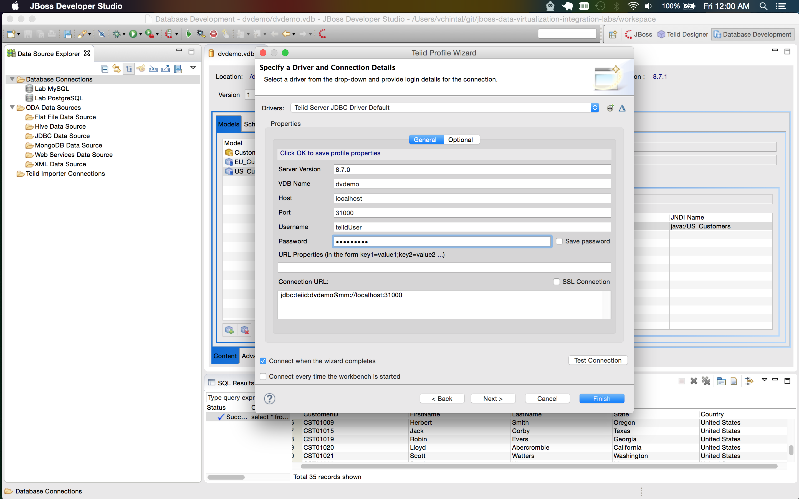](.images/lab4-13-conn-properties.png)

Test the connection before clicking on **Finish** and connect to the connection once successfull. Browse thru the DB hierarchy and verify the **Customers.all_customers** metadata as shown below

[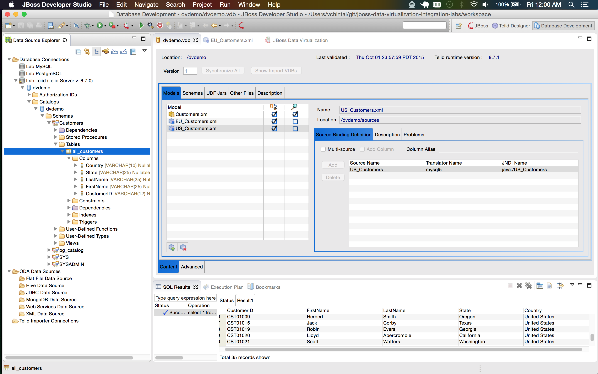](.images/lab4-14-conn-exploration.png)

Verify the virtual view is working by right clicking on the **all_customers** and choosing **Data → Sample Contents** as shown below.

[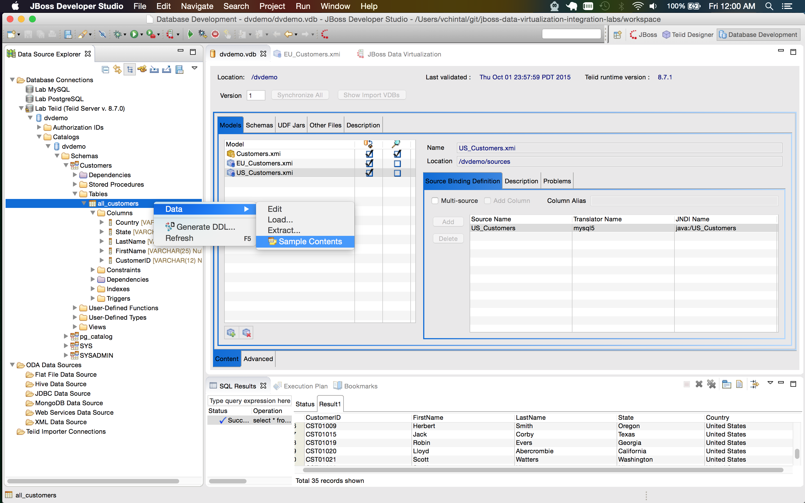](.images/lab4-15-sample-contents.png)

Verify the row count to match the pre-deployment rowcount of **35** as shown below. If you see the same output as shown below, you have completed the lab successfully.

Congrats!!

