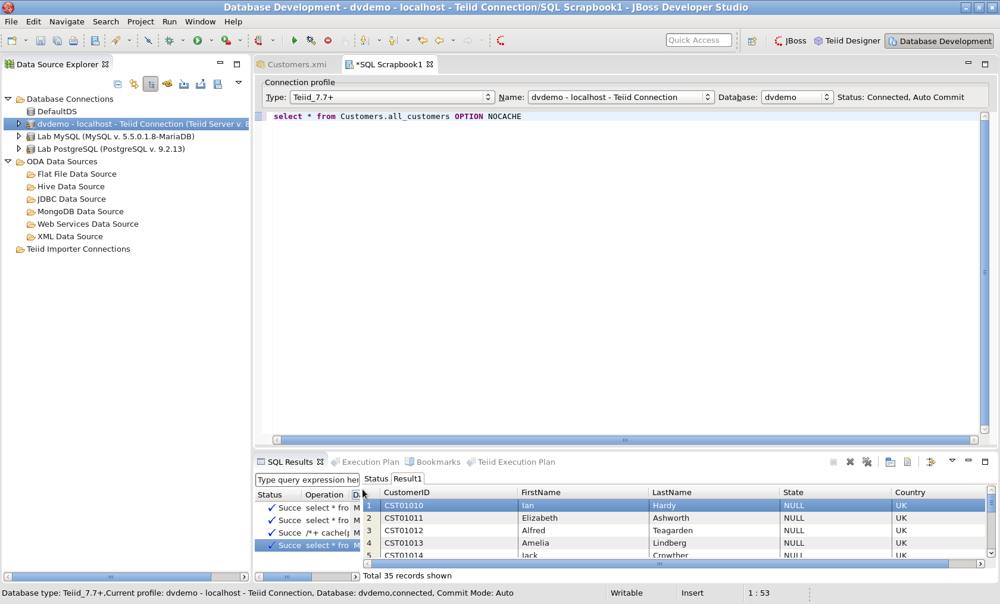
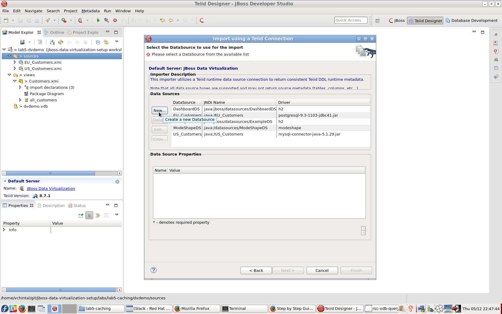

## Caching

|Quick Index|
|:---------|
|[Result Set Caching](#result-set-caching)|
|[Internal Materialization](#internal-materialization)|
|[External Materialization](#external-materialization)|

---

### Result Set Caching

Straight from the [documentation](https://access.redhat.com/documentation/en-US/Red_Hat_JBoss_Data_Virtualization/6.2/html-single/Development_Guide_Volume_5_Caching_Guide/index.html#chap-Result_Set_Caching) the definition of __Result Set Caching__ is: 

>User query result set caching will cache result sets based on an exact match of the incoming SQL string and PreparedStatement parameter values if present. Caching only applies to SELECT, set query, and stored procedure execution statements; it does not apply to SELECT INTO statements, or INSERT, UPDATE, or DELETE statements. 

__Key points to remember__

* Result set caching is **enabled by default** (with a default ttl)
* The client must **explicitly** choose to use result set caching by passing : `resultSetCacheMode=true` in the JDBC URL to the VDB
* The exact SQL string, including the cache hint if present, must match the cached entry for the results to be reused.
* Result set caching is **not** transactional
* From the web management console, one can choose to clear the result set cache of a specific VDB 
* Result set caching is **not limited to memory**

Consult the [documentation](https://access.redhat.com/documentation/en-US/Red_Hat_JBoss_Data_Virtualization/6.2/html-single/Development_Guide_Volume_5_Caching_Guide/index.html#chap-Result_Set_Caching) for more in-depth information about result set caching.

#### Testing Result Set Caching

**Step 1:** Execute **dvdemo**  VDB as shown in the image below: 

[](.images/rsc-deploy-vdb.png)

**Step 2:** Edit the connection to the **dvdemo** VDB :

1. Right-click on the **dvdemo - localhost - Teiid Connection** add URL property **resultSetCacheMode=true**. We will be using the **teiidUser** login for this purpose and click on **Finish** [](.images/rsc-teiid-jdbc-details.png)
2. Explore the Teiid connection just established and open an new SQL scrapbook to run queries [](.images/rsc-teiid-scrapbook.png)

**Step 3:** Run queries against the VDB without any customization (such as cache hints)

1. Try a plain, simple/sample query without any customization and review the **status** to see how long it took to run the query  
[](.images/rsc-vdb-query-without-caching.png)   
Note in the image below, the status says that query took **1 sec and 63 ms** [](.images/rsc-vdb-query-without-caching-status.png) 
2. Re-execute the same query and check on how long it took to run the same query with **default caching enabled**. Based on the image below we saved appoximately **50 ms**. The time saved widens as the result sets gets larger and larger. [](.images/rsc-vdb-query-with-caching-status.png)

> Log files **server.log** and **teiid-command.log** under **$JDV_HOME/standalone/log** folder will be of great help is validating if the what query is being executed and if the query is reaching all the way to the underlying datasources

**Step 4:** Run queries against the VDB with **cache hints**

The format of the cache hint is: 
```sql
/*+ cache[([pref_mem] [ttl:n] [updatable])] [scope:(session|user|vdb)] */ select * from sample 
```

The official documentation is more effective in explaining cache hints and options. The following images show the usage of cache hints and options. 

1. Using Cache Hint [](.images/rsc-cache-hints-usage.png)
2. Overriding the use of cache results by appending **`OPTION NOCACHE`** to the end of the SQL query. Pay attention to the run time of the query to realize the cached results are not used [](.images/rsc-cache-option-nocache.png)

---

### Internal Materialization 

Internal materialization is caching of all records of a specific view (virtual table). Enabling Internal Materialization on a specific view is done in the **Teiid Designer** and ***before the view is packed into a VDB***, as shown in the image below. Focus on the field the Yellow tool-tip is pointing to; the **Materialized** property of the view is a drop-down with two options true/false. Enabling Internal Materialization is as simple as setting this property to **true**.
[](.images/internal-mat-enabling.png)

**Key points about Internal Materialization**

1. If the tranformation query behind the view has no cache hints, then ***the results are cached for the lifetime of the JVM***
2. One can assign a cache hint to the transformation query behind the view to enable **cache expiry** after a defined **ttl (time to live)** as shown below. **Note :** If a new query arrives after the cache contents have expired, it will trigger a full refresh of the cache while blocking the client. The alternative option is to set the vdb property **lazy-invalidate=true** such that the refresh happens ***asynchronously*** while serving **stale entries** [](.images/internal-mat-cache-hint.png)
3. One can **invalidate** the cache on demand using one of the two ways below. Invalidation **will** block the queries until the cache is refreshed.
  * Using the web based admin console of the DV runtime server. Focus on all the selected/highlighted entries in the image [](.images/internal-mat-admin-console.png)
  * Connecting to the deployed VDB via a SQL client and executing the command of the following form [](.images/internal-mat-sysadmin-refresh.png)
```sql
EXEC SYSADMIN.refreshMatView(viewname=>'Customers.all_customers', invalidate=>true)
```

#### Testing Internal Materialization

Testing internal materialization is only possible **after bundling the materialized view table into a VDB and (re-)deploying it**. Once deployed, just as shown above with any SQL client, any kind of **`SELECT`** query (with whatever WHERE clause conditions) against the view will fully populate the cache.

Subsequent queries then take advantage of the cached records. Also, the same cache hints as mentioned for the Result Set Caching apply to Internal Materialization as well, the cache hint needs to appear right in front of the transformation query. Any **ttl** provided in the caching hint will override the default **Time-to-Live** of the materialized view. Once the **TTL** expires, the rows get invalidated and the caching will happen the next time the view receives a query.

---

### External Materialization

External materialization in JBoss Data Virtualization is the process of persisting **all** the records of a **materialized view** to a **physical/source model** instead of storing the records in memory or being managed by Teiid BufferManager

The article that comes closest to guiding thru the steps pictorially can be found [here](https://developer.jboss.org/wiki/AHowToGuideForMaterializationcachingViewsInTeiid). In that article the external materialization is made in to a traditional relational source such as MySQL. 

We will challenge ourselves here and externally materialize a view to **MongoDB**.

#### Setup a MongoDB Source Model

**Step 1 :** In the current project, right click on the **sources** folder and choose **Import**

**Step 2 :** Choose **Teiid Connection >> Source Model** in the options provided as shown below and click **Next**
[](.images/mdb-teiid-source-import.png)

**Step 3 :** Click on **New** in the window that is presented as shown below
[](.images/mdb-new-data-source.png)

**Step 4 :** Populate the connection details as shown and click on **Apply** and then click on **Ok**
[](.images/mdb-connection-details.png)

After a successful connection the following window is displayed. Click **Next** on this screen and next to get to the screen shown in the subsequent image
[](.images/mdb-post-successful-connection.png)

**Step 5 :** Provide the Source Model name as shown in the image below and click **Next**
[](.images/mdb-source-model.png)

**Step 6 :** Click **Next** on the screen shown
[](.images/mdb-import-metadata.png)

**Step 7 :** Choose one of the existing tables and click on **Finish** just to proceed further. Imported tables will not be used, so it does not matter which one is chosen.
[](.images/mdb-choose-source-tables.png)

**Step 8 :** [OPTIONAL] In the newly created MongoDB source model delete the imported table by right-clicking on the table and choosing **Delete**. Save the source model when done.

[](.images/mdb-delete-imported-table.png)

#### Create Materialized Views

**Step 1 :** Right click on the view to externally materialize and choose **Create Materialized Views** as shown below:
[](.images/mat-views-create.png)

**Step 2 :** In the next dialog, choose the source model for the materialized view, as shown below, and click on **Finish**:
[](.images/mat-views-choose-model.png)

**Step 3 :** Open the source model when the materialized view is created, one should find a schema as shown below. Double-click on it to get to view the materialized table created.
[](.images/mat-views-schema-created.png)

**Step 4 :** One would usually keep the schema in place but we will move the table created under the schema to root of source model with **cut and paste** as shown below:

[](.images/mat-views-cut-table.png)

[](.images/mat-views-paste-table.png)

**Step 5 :** Delete the lingering empty by right-clicking on schema name and choosing **Delete**

[](.images/mat-views-delete-schema.png)

**Step 6 :** Set the **Name in Source** property of tables to the table names respectively

That is, **customers** would be set to **customers** 
[](.images/mat-views-name-in-source.png)

**Step 8 :** Final step, correct the **Materialized Table** property value of the **customers** as shown below:

The property value would be set to:   
**customers (Path=/dvdemo/sources/EXT_Customers.xmi)**

[](.images/mat-views-correct-mat-table.png)

#### Testing External Materialization

Package a **dvdemo.vdb** as shown below and ensure that each source model is bound to appropriate JNDI name as shown below. Also, uncheck the **visibility** of the source models as shown below.

[](.images/mat-views-package-vdb.png)

**Step 2 :** Deploy the VDB, connect to it view **Database Development** perspective and execute shown queries:

```sql
DELETE FROM EXT_Customers.all_customers;
INSERT INTO EXT_Customers.all_customers SELECT * FROM Customers.all_customers OPTION NOCACHE;
SELECT * FROM Customers.all_customers
```

[](.images/mat-views-external-test.png)

Note the run time of the query and check the server logs. Notice that the runtime is just few milli-seconds shorter than querying the view and the logs show that the results are being fetched from MongoDB instead of both the other sources.

[](.images/mat-views-server-log.png)

>Note: For this to work, as shown in the image, append **AutoCommitTxn=OFF** at the end the URL Properties to prevent triggering a XA transaction between datasources when we are not using XA datasource configuration in the runtime.
