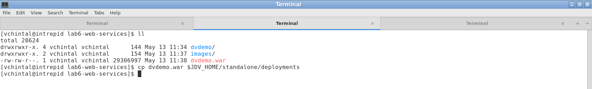

## Web Services Generation

|Quick Index|
|:---------|
|[RESTful Web Services](#restful-web-services)|
|[SOAP based Web Services](#soap-based-web-services)|
|[ODATA Web Services](#odata-web-services)|

---

### RESTful Web Services 

The easiest approach to generating Web Services is to let the Teiid Designer generate those for you. To generate the **REST** service for a view table, we need to have in place a virtual stored procedure that takes as many input parameters as the number of columns that constitute the primary key of the view table. Cases when there is no primary key on the view, then there are no input parameters to the virtual stored procedure.

#### Generate the REST war

**Step 1:** Right-click on the **Customers** view model and select **Modeling → Generate REST Virtual Procedures**, as shown in the image below:

**Step 2:** Fill in the details as shown in the image below and click on **OK**

**Step 3:** Save the **Customers** view model, click **Synchronize All** in the **dvdemo.vdb** and the right-click on the VDB and select **Modeling → Generate REST war** as shown below:

**Step 4:** Fill in the details in the pop-up window as shown below. Choose the folder of your choice for saving the WAR file. In this example the file is saved in the **lab6-web-services** folder.

**Step 5:** Deploy the VDB first (right-click on the VDB → Modeling → Deploy) before you attempt to deploy the generated **REST** war file in the manner shown below.

#### Test the REST war

Access the URL [http://127.0.0.1:8080/dvdemo/](http://127.0.0.1:8080/dvdemo/#!/Customers/all_customersRestProc) to access the deployed **REST** war and use the two REST methods as shown in the images below

### SOAP based Web Services

#### Generate the SOAP war

**Step 1:** Right-click on the **Customers** view model and select **Modeling → Create Web Service** as shown in the image below

**Step 2:** Leave the defaults in place and click on **Finish** in the screen below

**Step 3:** Verify the various models generated in the views folder

**Step 4:** Add the new view models to the VDB and save the VDB

**Step 5:** Right click on the **dvdemo.vdb** and choose **Modeling → Generate SOAP War**

**Step 6:** Fill in the details as shown in the image below and choose the **WAR File Save Location** of your choice. In this example, as with **REST** war file, the **SOAP** war file be placed in the **lab6-web-services** folder.

**Step 7:** Before deploying the **SOAP** war file, deploy the **dvdemo.vdb** as done in the above step and then deploy the **SOAP** war file as shown by the image below.

#### Test the SOAP services

**Step 1:** Access the **WSDL** for the **SOAP** service as shown below at location [http://127.0.0.1:8080/dvdemo-soap/Customers_all_customers?WSDL](http://127.0.0.1:8080/dvdemo-soap/Customers_all_customers?WSDL)

**Step 2:** Use a tool like **SoapUI** and create a new **SOAP Project** with the given **WSDL** file as shown below.

**Step 3:** Once the web service operations are listed, first test the **getall_customers** by double-clicking on the **Request 1** and then clicking on the green **Run/Play** button. The image below shows the request and response.

**Step 4:** Now test the **getNewProcedureResult** SOAP operation in the same manner but by providing a **CustomerID** as parameter to the request, as shown below.

