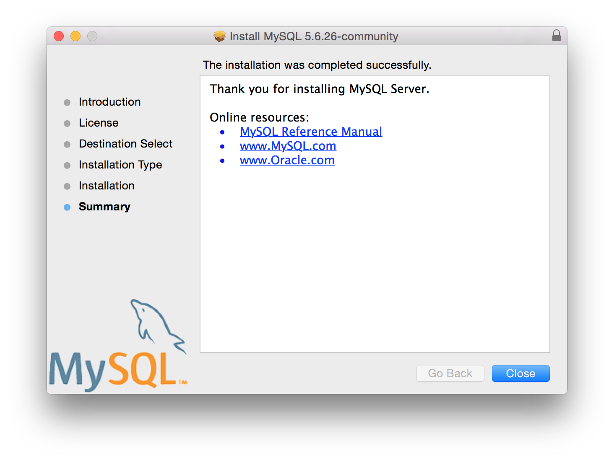

# Setup of Postgres and MySQL

|Index|
|-----|
|[Setup of Postgres on Linux Platforms](#setup-of-postgres-on-linux-platforms)|
|[Setup of Postgres on Mac OS X](#setup-of-postgres-on-mac-os-x)|
|[Setup of Postgres on Windows](#setup-of-postgres-on-windows)|
|[Setup of MySQL (MariaDB) on Linux platforms](#setup-of-mysql-on-linux-platforms)|
|[Setup of MySQL on Mac OS X](#setup-of-mysql-on-mac-os-x)|
|[Setup of MySQL on Windows](#setup-of-mysql-on-windows )|

## Setup of Postgres on Linux Platforms

### Installation on RHEL

If you have subscription on **RHEL** and Postgres was not installed during OS installation then follow the steps below:

```sh
sudo yum install postgresql-server.x86_64
sudo postgresql-setup initdb
sudo systemctl enable postgresql 
sudo systemctl start postgresql 
```

### Executing the provided sql script

```sh 
sudo su - postgres 
psql < financials-psql.sql
psql -d eucustomers <<EOF
CREATE USER dvuser WITH PASSWORD 'dvuser';
GRANT SELECT ON ALL TABLES IN SCHEMA public TO dvuser;
```

**Additional configuration** 

For access outside of the host on which Postgres server is running:

Add/verify the following entries in **/var/lib/pgsql/data/pg_hba.conf**
```
host    all             all             0.0.0.0/0             md5
```

Add/verify the following entries in **/var/lib/pgsql/data/postgresql.conf**
```
listen_addresses = '*'
```

Restart the service after the changes are done to above files.

## Setup of Postgres on Mac OS X

### Installation

1. Go to [http://postgresapp.com/](http://postgresapp.com/)
2. Click on the download button and download the zip file. Unzip the file into **Applications** directory
3. Click open **Postgres.app** in **Applications**, verify the **DATA** directory in the preferences

### Executing the provided sql script

The steps are same as in Unix/Linux except:
* You do not need to `sudo` into **postgres** user, so skip this line and execute the rest of the commands
* The files **pg_hba.conf** and **postgresql.conf** reside in the **DATA** directory as per the preferences

## Setup of Postgres on Windows 

### Installation

1. Grab the binary for windows from [here](http://www.enterprisedb.com/products-services-training/pgdownload#windows)
2. Run the executable and follow the sequence of steps as shown : [](.images/pg-win-welcome.png) [](.images/pg-win-install-dir.png) [](.images/pg-win-data-dir.png) [](.images/pg-win-port.png) [](.images/pg-win-password.png) [](.images/pg-win-locale.png) [](.images/pg-win-ready.png)

### Executing the provided sql script

First, add the path to the **bin** folder of the PostgreSQL server installation to the **%PATH%** variable as shown below:

[](.images/pg-win-env.png)

Then, run the following commands:
```sh 
psql -U postgres < financials-psql.sql
psql -U postgres -d eucustomers
CREATE USER dvuser WITH PASSWORD 'dvuser';
GRANT SELECT ON ALL TABLES IN SCHEMA public TO dvuser;
```
Follow the same additional steps to modify the **pg_hba.conf** and **postgresql.conf** in the **DATA** directory as shown above for Unix/Linux environments.

## Setup of MySQL on Linux platforms 

### Installation 

For installation on **RHEL/CentOS/Fedora and Debian/Ubuntu** please use [article from Tecmint](http://www.tecmint.com/install-mariadb-in-linux/)

If you have subscription on **RHEL** and MariaDB was not installed during OS installation then follow the steps below:
```sh
sudo yum install mariadb-devel.x86_64 mariadb-libs.x86_64 mariadb-server.x86_64
sudo systemctl enable mariadb
sudo systemctl start mariadb
```

### Executing the provided sql script
```
sudo mysql < ~/financials-mysql.sql 
sudo mysql <<EOF 
create user 'dvuser'@'%' identified by 'dvuser';
grant all on uscustomers.* to 'dvuser'@'%';
EOF
```

## Setup of MySQL on Mac OS X

### Installation 

1. Download the MySQL binary for Mac OS X by clicking on the link [mysql-5.6.26-osx10.9-x86_64.dmg](http://dev.mysql.com/downloads/file.php?id=458460)
2. Load the disk image, run the MySQL installer and follow the steps show in the images below: [](.images/mysql-osx-intro.png) [](.images/mysql-osx-license.png)  [](.images/mysql-osx-agreement.png)  [](.images/mysql-osx-install-type.png) [](.images/mysql-osx-summary.png) Once the MySQL is installed, go to the **System Preferences**, click on MySQL and start the server as shown below [](.images/mysql-osx-status.png)
3. Add **/usr/local/mysql-5.6.26-osx10.8-x86_64/bin** to the $PATH variable 

### Executing the provided sql script

With mysql on the $PATH, import the data into **mysql** as shown in the Unix/Linux section 

## Setup of MySQL on Windows 

### Installation

1. Download the MySQL binary by clicking on the link [mysql-installer-community-5.6.26.0.msi] (http://dev.mysql.com/downloads/file.php?id=458483) 
2. Accept the license agreement and click **Next** [](.images/mysql-win-licence.png)
3. Choose **Developer Default** setup type and click **Next** [](.images/mysql-win-setup-type.png)
4. In **Check Requirements** pane, click **Next** and when prompted with a confirmation, choose **Yes** [](.images/mysql-win-check-reqs.pnmages/mysql-win-check-reqs.png)
5. Click **Execute** in the **Installation** pane and when all tasks are successfully completed move ahead [](.images/mysql-win-installation.png)
6. Click **Next** in the **Product Configuration** pane [](.images/mysql-win-product-configuration.png)
7. In **Type and Networking**, choose the defaults and click **Next** [![].images/mysql-win-type-networking.png()](.images/mysql-win-type-networking.png)
8. In **Accounts and Roles**, give a root password of your choice and click **Next** [](.images/mysql-win-accounts-roles.png)
9. In **Windows Service**, choose the defaults and click **Next** [](.images/mysql-win-service.png)
10. In **Apply Server Configuration**, click on **Execute** and when finshed continue further [](.images/mysql-win-apply-server-config.png)
11. You can skip the samples piece by clicking **Cancel** on that step and in the final pane click **Finish** to complete the installation

### Executing the provided sql script

Run the script as root using the following command (assuming that `mysql` command is on %PATH%)
```sql
mysql -u root -p < C:\financials-mysql.sql
```
**Create `dvuser` for access to the `uscustomers` database**

Login as `root`:
```sql
mysql -u root -p
```
At mysql prompt run the following commands:
```sql
create user 'dvuser'@'%' identified by 'dvuser';
grant select on uscustomers.* to 'dvuser'@'%';
```
